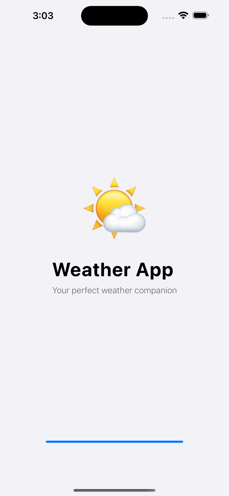
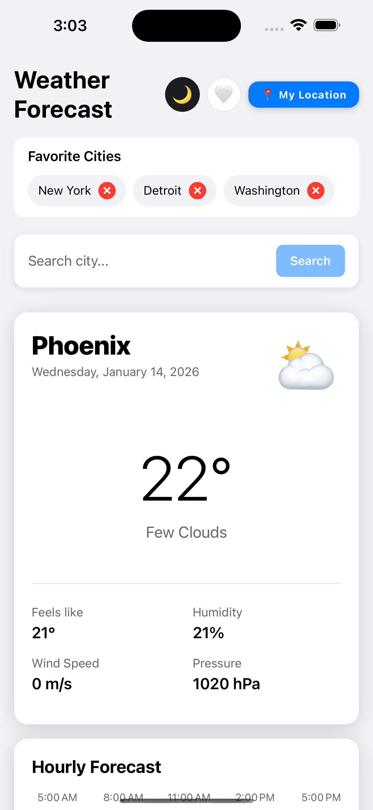
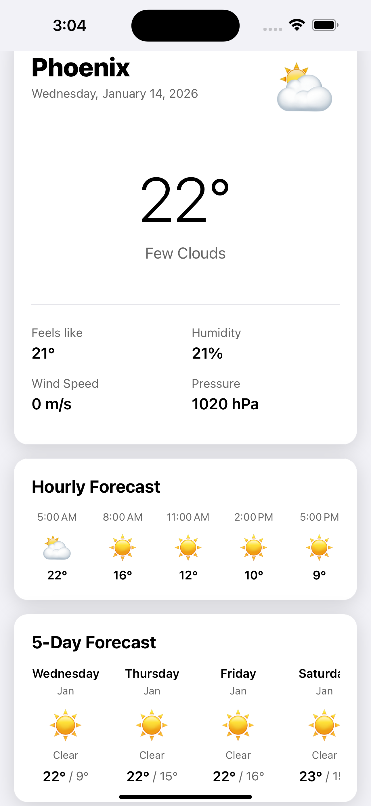
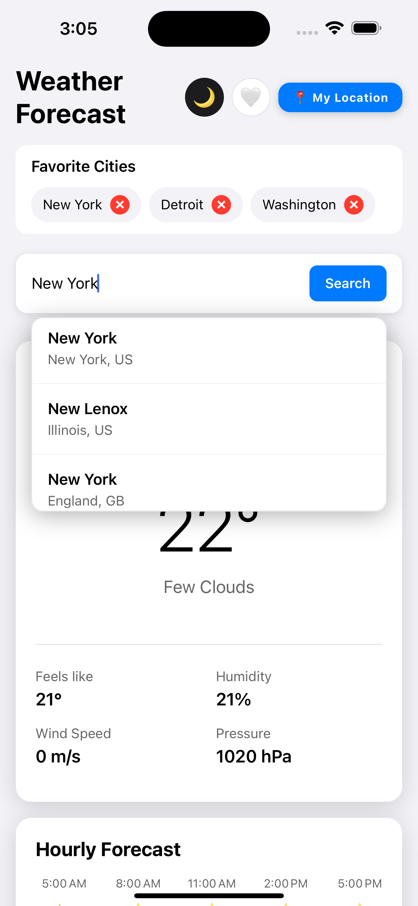
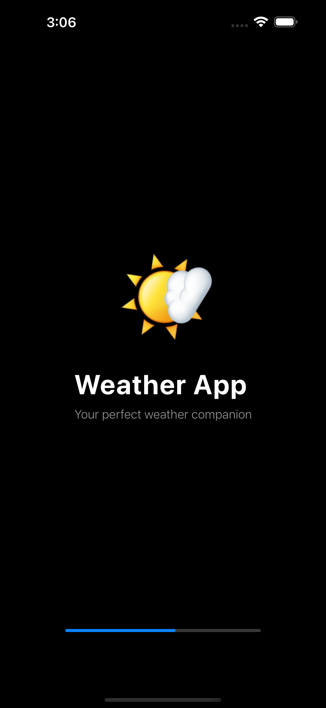
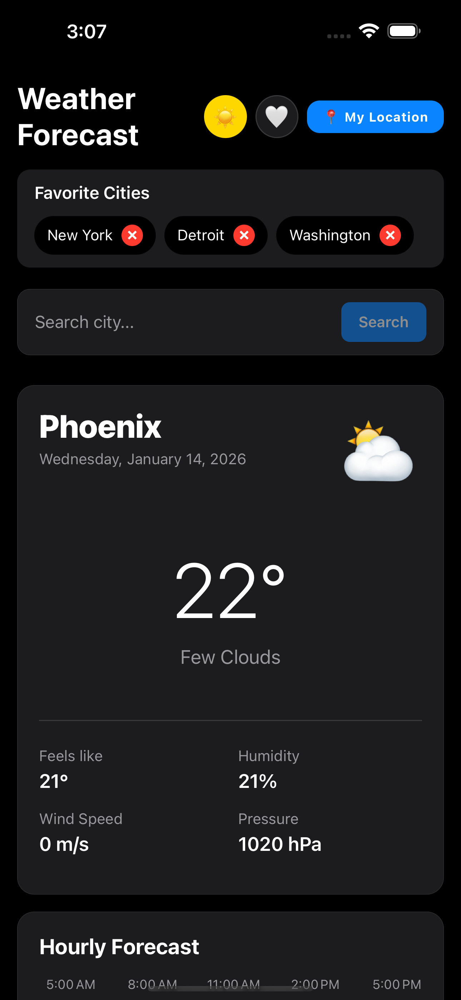
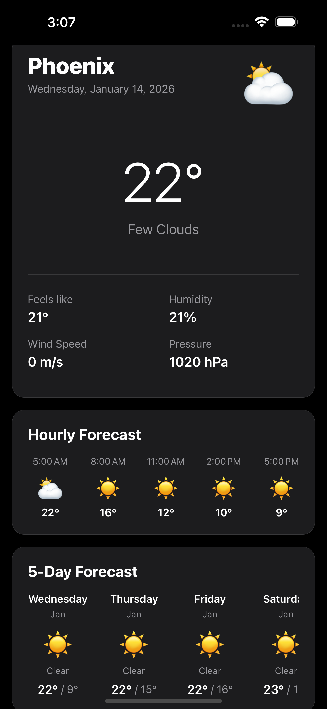

# Weather App

A React Native mobile weather forecast application that displays current weather and a 5-day forecast for the user's location or any searched city.

## Features

### Core Features
- ✅ Current weather display with temperature, condition, humidity, and wind speed
- ✅ 5-day weather forecast with daily high/low temperatures and weather icons
- ✅ Automatic geolocation detection
- ✅ City search functionality with debounced suggestions
- ✅ Loading states and error handling with user-friendly UI feedback
- ✅ Offline support with cached weather data (last fetched data available offline)

### Bonus Features
- ✅ Dark mode support with manual toggle button
- ✅ Pull-to-refresh functionality
- ✅ Favorite cities for quick access
- ✅ Hourly forecast view for the current day
- ✅ Weather icons with emoji representation
- ✅ Smooth animations and transitions
- ✅ Animated splash screen

## Prerequisites

Before you begin, ensure you have met the following requirements:

- **Node.js** (>= 20)
- **npm** or **yarn**
- **React Native development environment**:
  - **For iOS**: 
    - macOS (required)
    - Xcode (latest version recommended)
    - CocoaPods (`sudo gem install cocoapods`)
    - iOS Simulator or physical device
  - **For Android**:
    - Android Studio
    - Android SDK (API level 33+)
    - Android Emulator or physical device
    - Java Development Kit (JDK)
- **OpenWeatherMap API key** (free tier available at [openweathermap.org](https://openweathermap.org/api))

## Setup Instructions

### 1. Clone the Repository

```bash
git clone <repository-url>
cd weather-app
```

### 2. Install Dependencies

```bash
npm install
```

### 3. Configure API Key

1. Sign up for a free account at [OpenWeatherMap](https://openweathermap.org/api)
2. Get your API key from the [API keys page](https://home.openweathermap.org/api_keys)
3. Open `src/constants/config.ts`
4. Replace `YOUR_API_KEY_HERE` with your actual API key:

```typescript
export const WEATHER_API_KEY = 'your_actual_api_key_here';
```

**Note**: API keys may take 10 minutes to 2 hours to activate after signup.

### 4. iOS Setup

```bash
cd ios
bundle install
bundle exec pod install
cd ..
```

### 5. Android Setup

No additional setup required. Android dependencies are managed through Gradle.

## Running the App

### Start Metro Bundler

In the project root directory, run:

```bash
npm start
```

This will start the Metro bundler. Keep this terminal window open.

### Run on iOS

In a new terminal window:

```bash
npm run ios
```

This will:
- Build the iOS app
- Launch the iOS Simulator
- Install and run the app

**Alternative**: Open `ios/WeatherAppTemp.xcworkspace` in Xcode and run from there.

### Run on Android

In a new terminal window:

```bash
npm run android
```

**Prerequisites**:
- Android emulator must be running, OR
- Physical Android device connected via USB with USB debugging enabled

## Project Structure

```
weather-app/
├── src/
│   ├── components/          # Reusable UI components
│   │   ├── Card.tsx
│   │   ├── CitySuggestions.tsx
│   │   ├── CurrentWeather.tsx
│   │   ├── Error.tsx
│   │   ├── FavoriteButton.tsx
│   │   ├── FavoritesList.tsx
│   │   ├── ForecastList.tsx
│   │   ├── HourlyForecast.tsx
│   │   ├── Loading.tsx
│   │   ├── SearchBar.tsx
│   │   ├── ThemeToggle.tsx
│   │   └── WeatherIcon.tsx
│   ├── context/             # React Context providers
│   │   ├── ThemeContext.tsx
│   │   └── WeatherContext.tsx
│   ├── hooks/               # Custom React hooks
│   │   ├── useDebounce.ts
│   │   └── useFavorites.ts
│   ├── screens/             # Screen components
│   │   ├── SplashScreen.tsx
│   │   └── WeatherScreen.tsx
│   ├── services/            # API and service layers
│   │   ├── geocoding.ts
│   │   ├── geolocation.ts
│   │   ├── storage.ts
│   │   └── weatherApi.ts
│   ├── types/               # TypeScript type definitions
│   │   └── weather.ts
│   ├── utils/               # Utility functions
│   │   ├── dateUtils.ts
│   │   ├── errorUtils.ts
│   │   └── forecastUtils.ts
│   └── constants/           # App constants
│       └── config.ts
├── App.tsx                  # Main app entry point
├── index.js                 # App registration
└── package.json
```

## Architecture & Key Decisions

### State Management
- **Context API**: Used for global state management (weather data and theme)
  - `WeatherContext`: Manages weather data, loading states, and API calls
  - `ThemeContext`: Manages theme (light/dark mode) with persistent preference
- **Local State**: React hooks (`useState`, `useEffect`) for component-level state
- **Custom Hooks**: 
  - `useFavorites`: Manages favorite cities list
  - `useDebounce`: Debounces search input for API calls

### Data Fetching & Caching
- **API Service**: Centralized weather API service (`weatherApi.ts`) with comprehensive error handling
- **Geocoding Service**: Separate service for city search suggestions
- **Offline Support**: AsyncStorage for caching weather data
  - Caches: current weather, forecast, location, city name, favorites, theme preference
  - Cache duration: 5 minutes (configurable in `src/constants/config.ts`)
  - Automatic cache loading on app startup
  - Graceful degradation: Shows cached data if API fails

### Styling & Theming
- **Theme Context**: Centralized theme management with dark mode support
- **Dynamic Theming**: All components adapt to light/dark mode automatically
- **StyleSheet**: React Native StyleSheet for optimized performance
- **Premium Design**: Enhanced typography, shadows, and spacing for modern UI

### Component Design
- **Small, Reusable Components**: Each component has a single responsibility
- **Composition**: Components are composed to build complex UIs
- **Type Safety**: Full TypeScript support with proper type definitions
- **Animations**: Smooth animations using React Native Animated API

### Error Handling
- **User-Friendly Messages**: Custom error utility converts technical errors to readable messages
- **Graceful Degradation**: App shows cached data if API fails
- **Retry Functionality**: Error components include retry buttons
- **Network Error Detection**: Specific handling for network vs API errors

### Search Functionality
- **Debounced Search**: 500ms delay to reduce API calls
- **City Suggestions**: Real-time suggestions using OpenWeatherMap Geocoding API
- **Loading States**: Visual feedback during search
- **Scrollable Suggestions**: Dropdown list with proper scrolling

## Assumptions & Trade-offs

### Assumptions
- Users have location permissions enabled (app requests permission on first use)
- Internet connection available for initial data fetch (cached data available offline)
- OpenWeatherMap API is accessible and responsive
- Users understand basic weather terminology (temperature, humidity, etc.)

### Trade-offs
1. **Emoji Icons**: Used emoji instead of icon libraries (like react-native-vector-icons) for simplicity and zero additional dependencies. Trade-off: Less customizable but simpler.

2. **Context API vs Redux**: Chose Context API for simplicity given the app's moderate size. Trade-off: May need refactoring if app scales significantly, but simpler for current scope.

3. **AsyncStorage**: Used for offline caching instead of more robust solutions (like SQLite). Trade-off: Simpler but limited to key-value storage. Sufficient for current use case.

4. **Manual Cache Management**: No state persistence library. Trade-off: More control but requires manual cache invalidation logic.

5. **Debounced Search**: 500ms delay balances responsiveness with API call reduction. Trade-off: Slight delay in suggestions but reduces API usage.

6. **Single Screen App**: No navigation between multiple screens. Trade-off: Simpler but less scalable if features expand.

## Testing

Run tests with:

```bash
npm test
```

Current test coverage includes:
- Weather API service tests
- Date utility function tests
- Basic app rendering test

## Screenshots

Add your screenshots here once you've taken them. To add screenshots:

1. **Take screenshots** from iOS Simulator (`Cmd + S`) or Android Emulator (camera icon)
2. **Save them** in the `screenshots/` folder with descriptive names
3. **Commit and push** the images to your GitHub repository
4. **Reference them** in the README using the format below:

```markdown
### iOS









### Android


```


## Troubleshooting

### Metro Bundler Issues
If you encounter module resolution errors:
```bash
npm start -- --reset-cache
```

### iOS Build Issues
```bash
cd ios
rm -rf build Pods Podfile.lock
bundle exec pod install
cd ..
```

### Android Build Issues
```bash
cd android
./gradlew clean
cd ..
```

### API Key Not Working
- Ensure API key is correctly set in `src/constants/config.ts`
- Wait 10 minutes to 2 hours after signup for activation
- Check API key status at [OpenWeatherMap Dashboard](https://home.openweathermap.org/api_keys)

## License

This project is created for evaluation purposes.

## Author

Built as a test project for React Native Developer position evaluation.
